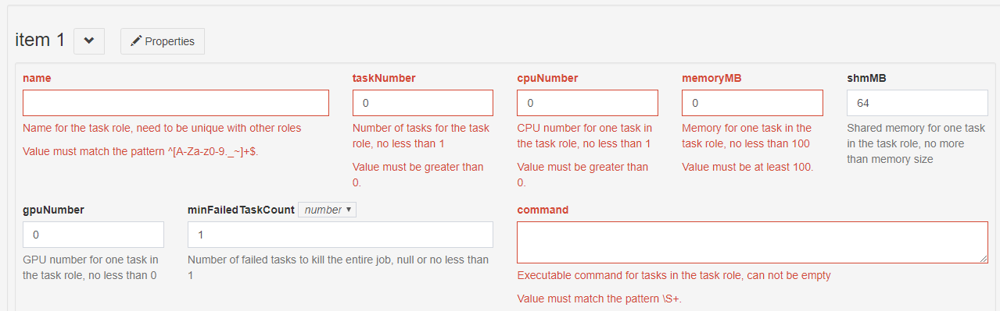
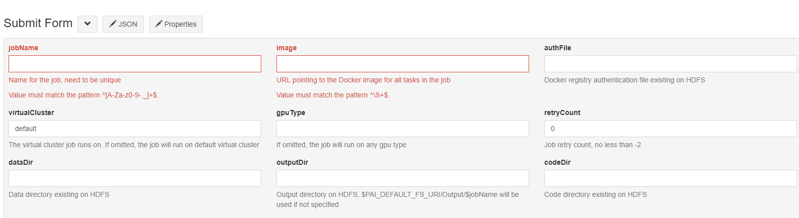
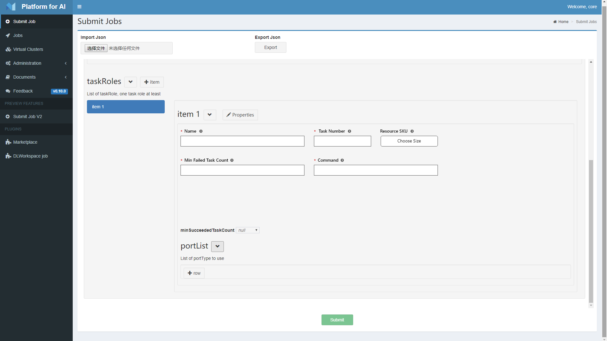
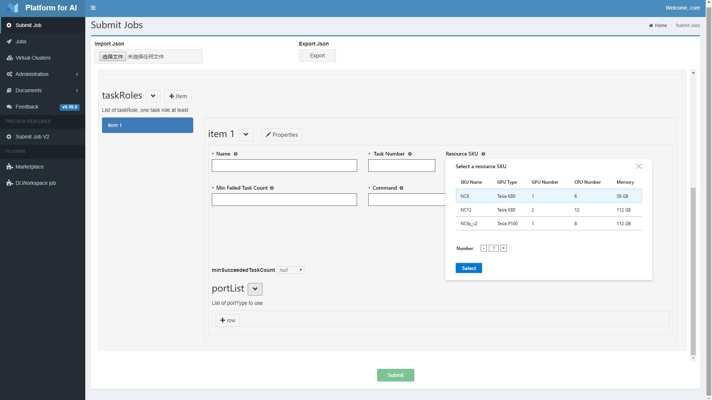
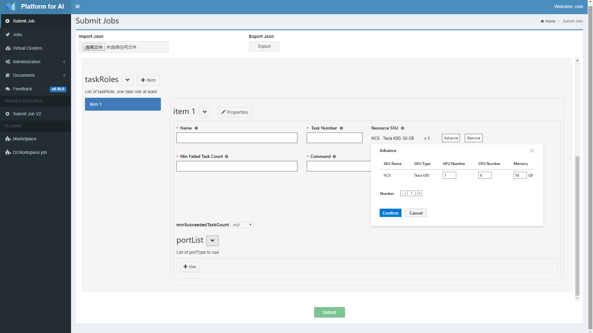

# User Experience Enhancement for PAI skus

## Motivation
The current submitting job interface may confuse some user in two points:
1. The task submit interface have 4 seperated field: gpuNumber, cpuNumber, memoryMB, shmMB. For most users, they may lack some infrastructure knowledge about what size each field should be. So it will be more convenient if some recommended skus provided for user. And it may also help resource scheduling.
 
2. The gpu type can only be defined in job level, that means all taskroles should use same gpu type (i.e. same node type). It could be more flexible if each task could have specific gpu type.



## Solution
1. Provide combined sku resource level instead of seperate resource field. For example:
```
{
  "gpu_type": "NVIDIA Tesla P100",
  "gpu_num": 2,
  "cpu_num": 6
  "memory": 50,
}
```
For advanced users, add a custom option to change field separately.
For admin users, give them the authority to create, review, update, delete sku settings.

2. Move gpu type down into each task config as part of sku definition. The scheduler might be changed correspondingly.

## Experience
- Common User
1. This design changes experience of submitting job behavior. 
2. When submitting a job, user can create muliple task roles and multiple tasks in one task role, this part does not change.
3. When editing the task config, the ```cpuNumber```, ```memoryMB```, ```shmMB``` and ```gpuNumber``` fields are removed.
4. A sku field is added. When user click on it, a sku list will pop up, each line contains specific info (example):

| SKU Name | GPU Type  | GPU Number | CPU Number | Memory |
|----------|---------- |------------|------------| -------|
| NC6      | Tesla K80 | 1          | 6          | 56  GB |
| NC12     | Tesla K80 | 2          | 12         | 112 GB |
| NC6s_v2  | Tesla P100| 1          | 6          | 112 GB |




5. Besides the sku grid, there will be also exists a ```* num``` field which indicates the number of sku resource unit user will use. 


6. Finally there will be an ```advance``` button lays besided sku grid. After click it, user could edit the detailed info of sku, i.e.   ```cpuNumber```, ```memoryMB```, and ```gpuNumber``` fields. There will be a warning to aware user this will create a custom resources for the task.



- Operator
1. Almost same as common user
2. Admin user could check current sku settings and have a instruction about how to edit sku config.
- IT Admin
1. Add GPU SKU configuration setting in node configMap during server maintainence.

## Interface
- The web portal api might be extended according to [the resources api definition](./pai_resources_extension_api.yaml)
- If the job submitting interface changes to accept sku parameter, then the frontend will send sku parametes to backend. Else, the front end will translate sku to origin resource parametes and send back.

## Issues
- What will the ```shmMB``` field be treated? Add to sku / leave as is / removed?